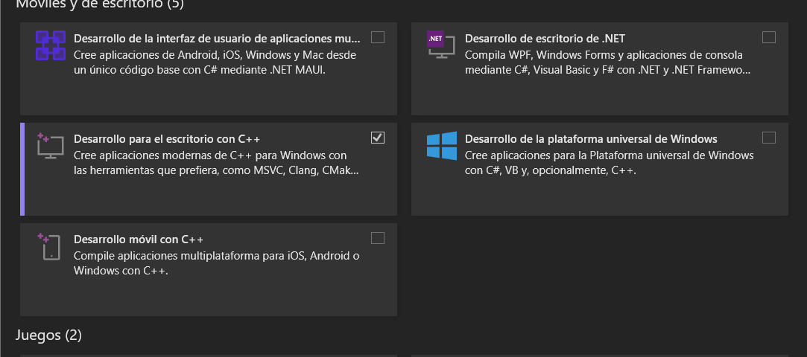
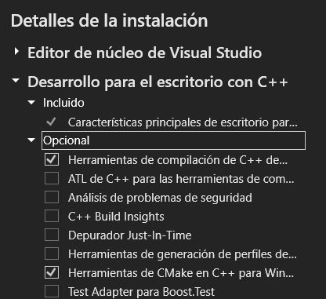
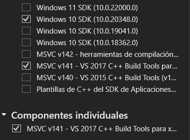

# Backend

### Ambiente
Para correr la etapa de obtención de representaciones 3D es necesario contar con:
* [COLMAP](https://colmap.github.io/install.html)
* [CUDA (probado con v11.8)](https://developer.nvidia.com/cuda-11-8-0-download-archive)

    **OBS**: Para instalar CUDA en Windows es necesario tener:
    - [Visual Studio](https://visualstudio.microsoft.com/es/) (en este caso se usó el Community 2022)
    - Visual C++ Build Tools (v14.0 o mayor): Esto se agrega en el Visual Studio Installer

        
        
        
* Librerías de Python (están en el requirements.yml)

Se recomienda usar Anaconda, creando un ambiente que tenga las librerías especificadas en el archivo `jachkar-museum/crowdsourcingApp/backend/representationModel/requirements.yml` usando:

```
    conda env create -f environment.yml
```

### Uso

Los pasos para obtener una representación tridimencional, son:
* Poner el video en la carpeta: `jachkar-museum/crowdsourcingApp/backend/representationModel/videos`
* Ir a la carpeta `jachkar-museum/crowdsourcingApp/backend/representationModel`
* Correr en una terminal `python pipeline.py <nombre_video> <n_frames>`
